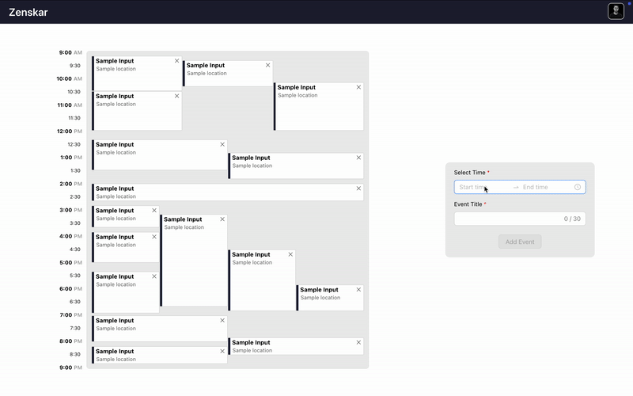
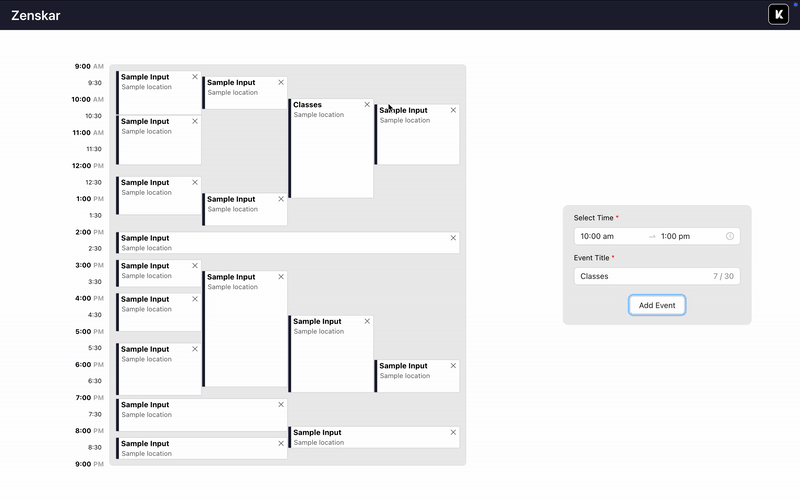

# Zenskar Assignment: Front End Engineer Intern (Founding Member)

## Introduction

This project is a **Single-Day Calendar Layout** built in **React**, following the constraints outlined in the assignment. It visually organizes a set of events without overlapping while ensuring concurrency is represented correctly.

## Features

- **Non-overlapping events**: Events are laid out without any visual overlap.
- **Concurrent event width sharing**: Events occurring at the same time share the available width equally.
- **Optimized width utilization**: Maximizes available space while maintaining constraints.
- **Custom event addition**: Users can add new events dynamically.
- **Styled using Ant Design & Styled Components**.

## Tech Stack

- **React** (UI Development)
- **TypeScript** (Static typing for maintainability)
- **Styled Components** (CSS-in-JS for styling)
- **Ant Design** (UI components)
- **UUID** (Unique ID generation)

## Installation & Setup

### Clone the Repository

```sh
git clone https://github.com/kripanshu-singh/day-view.git
cd day-view
```

### Install Dependencies

```sh
npm install
```

### Run the Development Server

```sh
npm run dev  # Runs on http://localhost:3006
```

## Project Structure

```
📦 src
 ┣ 📂 components  # UI Components
 ┃ ┣ 📜 AddEvent.tsx  # Add event form
 ┃ ┣ 📜 Calendar.tsx  # Calendar layout
 ┃ ┣ 📜 Header.tsx  # Page header
 ┃ ┣ 📜 utils.ts  # Event processing logic
 ┣ 📜 App.tsx  # Main App component
 ┣ 📜 index.css  # Global styles
 ┣ 📜 main.tsx  # Entry point
📜 package.json  # Project dependencies
📜 README.md  # Documentation
```

## Code Walkthrough

### `App.tsx`

- The root component that renders the `Header`, `Calendar`, and `AddEvent` components.
- Manages the state for events using `useState`.

### `Calendar.tsx`

- Renders the calendar layout and processes events using the `processEvents` function.
- Maps over the processed events to render individual `Event` components.

### `AddEvent.tsx`

- Provides a form for adding new events.
- Uses `TimePicker` from Ant Design for time selection.

### `utils.ts`

- **`assignWindows`**: Groups events into windows to avoid overlap.
- **`groupEventsByColumns`**: Organizes events into columns for rendering.
- **`calculateLayout`**: Calculates the position and width of each event.
- **`processEvents`**: Combines the above functions to process the event data.

## Implementation Details

### Layout Logic

1. **Event Positioning**:

   - Events are sorted by `start` time.
   - Each event is assigned a "window" to group overlapping ones.
   - Events within the same window are divided into columns.
   - Each event's `left` and `width` are computed dynamically.

2. **Adding New Events**:
   - Users select a start & end time using an interactive picker.
   - Events are converted to minutes since 9 AM before being added.
   - UUIDs are assigned to new events.

## Deployment Instructions

### Build for Production

```sh
npm run build
```

### Preview Production Build

```sh
npm run preview
```

## Additional Features & Demo

In addition to the core functionality, I have implemented **event addition and deletion**, allowing users to interact with the calendar dynamically. These features are demonstrated below:

### Adding an Event

  

### Deleting an Event

  

Thanks for reviewing my submission! Looking forward to discussing it. 😊
